## Seccion 1

**Datos vs Informacion**

Datos: Hechos recopilados sobre un tema

Informacion: Resultado de la combinacion, comparacion y realizacion de calculos de los datos

**Base de Datos**

Es un conjunto estructurado y centralizado de datos almacenados en un sistema de computadoras que proporciona los medio para recuperar, agregar, modificar y suprimir los datos cuando sea necesario.

**Introduccion a las bases de datos relacionales**

Una base de datos relacional almacena la informacion en tablas con filas y columnas

Una tabla es una recopilacion de registros en donde la fila se le denomina registro (o instancia) y a la columna se le denomina campo (o atributo)

**Elementos de un DBMS**

Un DBMS es el software que controla el almacenamiento, organizacion y la recuperacion de datos, contiene los siguientes elementos:

- Gestion de almacenamiento y memoria
- Diccionario de datos
- Lenguaje de consulta

**Transformacion de la computacion**

1970: Computacion de mainframe (procesamiento centralizado)

1980: Computacion de escritorio (procesamiento localizado)

1990: Computacion cliente/servidor (procesamiento local y centralizado)

2000: Grid computing (procesamiento compartido)

2010: Computacion en la nube (procesamiento basado en internet)

**Proceso de desarollo de bases de datos**

- Modelado de datos conceptuales
- Diseño de base de datos
- Creacion de base de datos

**Tipos de modelos de bases de datos**

- Modelo relacional: Los datos se representan como una recopilacion de tablas, cada columna representa los atributos que pertenecen a la tabla. cada fila es una instancia de la tabla, cada tabla es la representacion visual de las columnas y filas.
- Modelo de archivo plano: son archivos planos en texto sin formato, en el que cada linea contiene solo un registro, esta diseña en torno a unica tabla.
- Modelo orientado a objetos: Una entidad se modela como un objeto, cada objeto tiene un estado y un comportamiento, la relacion entre objetos se establece compartiendo acceso, puede derivar una nueva clase de una existente.
- Modelo jerarquico: Los datos se organizan en una estructura de arbol, los datos se almacenan como registros que están conectados entre si mediante enlaces.
- Modelo de red: Es un modelo que se puede considerar como una forma flexible de representar objetos y sus relaciones, consta de una recopilacion de registros conectados entre si mediante enlaces, cada registro es una recopilacion de campos cada uno de los cuales contiene solo un valor de datos.

**Importancia de las reglas de negocio**

- Permiten al desarrollador/arquitecto comprender la relacion y las restricciones de las entidades participantes
- Ayudan a entender el procedimiento de normalizacion que sigue una organizacion al manejar una gran cantidad de datos
- Deberian ser simples y faciles de entender
- Deben mantenerse actualizadas

La reglas de negocio se utilizan para comprender los procesos de negocio y la naturaleza, el rol y el ambito de los datos, tambien ayudan a clasificar y diseñar las tablas de la base de datos

Las reglas de negocio las proporcionan:

- Gestores
- Creadores de politicas
- Manuales de funcionamiento y documentacion
- Estandares y procedimientos de organizacion
- Entrevistas con los usuaros finales.

## Seccion 2

**Tabla unica**

Una base de datos de archivos planos es un tipo de base de datos que almacena datos en una única tabla

Las bases de datos de archivos planos están normalmente en texto sin formato, en el que cada linea contiene solo un registro.

**Ventajas e inconvenientes de una base de datos de archivos planos**

Ventajas:

- Facil de comprender
- Facil de implantar
- Facil de extraer informacion
- Todos los registros se almacenan en un solo lugar
- Ordenamiento y filtrado de informes simple
- Menos requisitos de hardaware y software

Inconvenientes:

- Menos seguridad
- Inconsistencia de datos
- Redundancia de datos
- Uso compartido de informacion laborioso
- Lentitud para bases de datos de gran tamaño

**Bases de datos relacionales**

- Una base de datos relacional presenta la informacion en tablas con filas y columnas

- Cada columna representa un tipo concreto de informacion (un campo) y cada fila muestra un registro

- A continuacion, las tablas se relacionan entre si mediante un campo comun

- Se utiliza un campo unico denominado clave, para identificar cada registro de una base de datos relacional

**Ventajas de una base de datos relacional**

- Menos redundancia
- Prevencion de inconsistencias
- Eficacia
- Integridad de los datos
- Confidencialidad

**Reglas para las tablas de bases de datos relacionales**

- Cada tabla tiene un nombre distinto
- Cada tabla puede contener varias filas
- cada tabla tiene un valor para identicar de forma unica las filas
- Cada columna de una tabla tiene un nombre unico
- Las entradas en las columnas son valores unicos
- Las entradas en las columnas son del mismo tipo
- El orden de las filas y las columnas no es importante

**Modelos de datos conceptuales y fisicos**

¿Que es un modelo conceptual?

- Captura las necesidades funcionales y de informacion de un negocio
- Se basa en las necesidades actuales, pero puede reflejar las necesidades futuras
- Aborda las necesidades de un negocio (lo ideal desde el punto de vista conceptual), pero no su implantacion (lo fisicamentee posible)

Identifica:

- Entidades importantes (objetos que se convierten en tablas en la base de datos)
- Relaciones entre entidades

No especifica:

- Atributos (objetos que se convierten en columnas o campos en la base de datos)
- Identificadores unicos (un atributo que se convierte en llave primaria en la base de datos)

¿Que es un modelo logico?

- Incluye las entidades y relaciones entre si
- Se denomina modelo de relacion de entidades (ERM)
- Se ilustra en un ERD
- Especifica todos los atributos y UID para cada entidad
- Determina la opcionalidad del atributo
- Determina la opcionalidad y la cardinalidad de la relacion

¿Que es un modelo fisico?

- Es una extension de un modelo de datos logico
- - Especifica las definiciones de tabla, los tipos de datos y la precision
  - Identifica las vistas, los indices y otros objetos de base de datos
- Describe como se deben implantar los objetos en una base de datos especifica
- Muestra todas las estructuras de tabla, incluidas las columnas, llaves primarias y claves foraneas

Los pasos para crear un modelo fisico son:

- Modelas entidades como tablas
- Modelar relaciones como claves foraneas
- Modelar atributos como columnas
- Modificar el modelo de datos fisico en funcion de las restricciones y requisitos fisicos

El modelado de datos es el proceso de captura de los conceptos y reglas importantes que forman un negocio y si representacion visual en un diagrama, el cual se convierte en el plan detallado para diseñar el elemento fisico

**Entidades y atributos**

Entidad: informacion de la que se debe realizar un seguimiento, Nombre de cosas que puede mostrar en una lista (normalmente en forma de sustantivo)

**Tipos de entidad**

- Principal: Existe de forma independiente
- Caracteristica: Existe gracias a otra entidad (principal)
- Interseccion: Existe gracias a dos o mas entidades

Las entidades contienen instancias, una instancia de entidad es una unica incidencia de una entidad, las entidades representan un juego de instancias que son de interes para un negocio concreto

Atributo: describen entidades y son la informacion especifica que se debe conocer, se trata de los detalles de una propiedad de un solo valor de una entidad

**Caracteristicas de los atributos**

- Los atributos se muestran en el cuadro de entidad del ERD
- Los nombres de atributo aparecen en singular y en minusculas, o mayusculas o minusculas
- En la mayoria de los casos, el nombre del atributo no debe incluir el nombre de la entidad, porque los atributos se cualifican con el nombre de la entidad

Los atributos se clasifican en Obligatorios (no se permiten valores nulos) y Opcionales (se permiten valores nulos).

**Atributos volatiles y no volatiles**

- Volatiles son atributos inestables por ejemplo la edad
- No volatiles: son atributos estables por ejemplo la fecha de nacimiento

**Atributos unicos y compuestos**

- Unicos o atomicos son los atributos que no se pueden dividir en subpartes
- Los compuestos son los atributos que se pueden dividir en subpartes mas pequeñas que representan atributos basicos con diferentes significados propios

**Atributos de un unico valor y de varios valores**

- Unico valor: pueden tener un solo valor en un momento concreto
- Varios valores: pueden tener mas de un valor al mismo tiempo

**Notaciones**

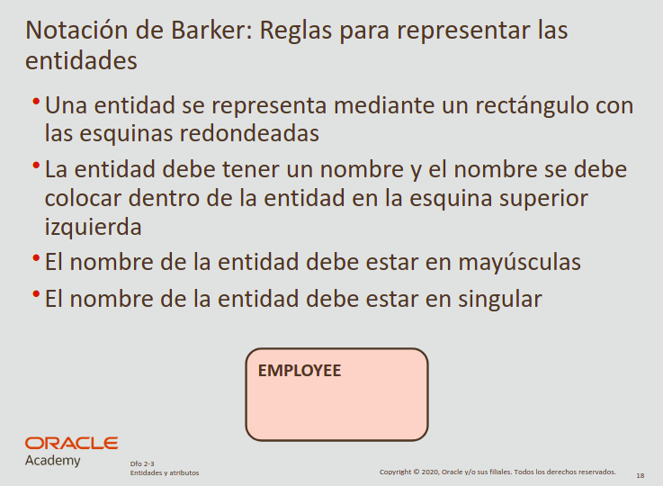

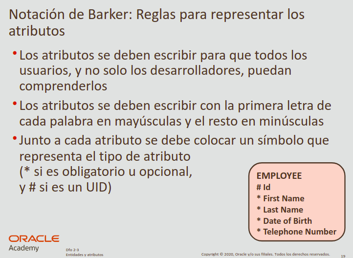

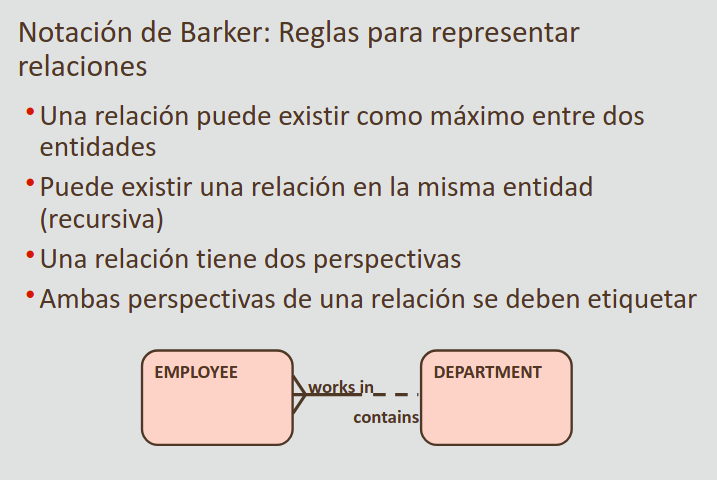

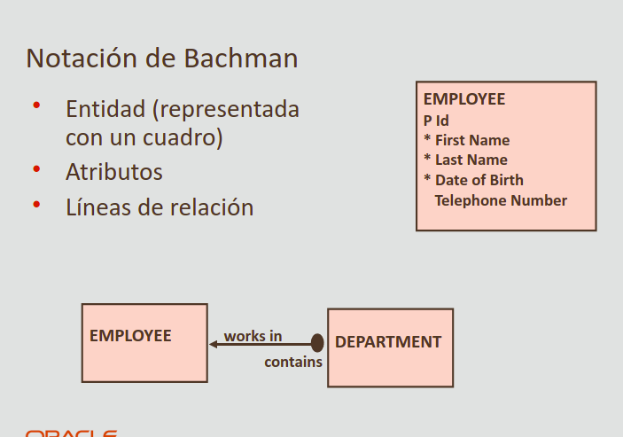

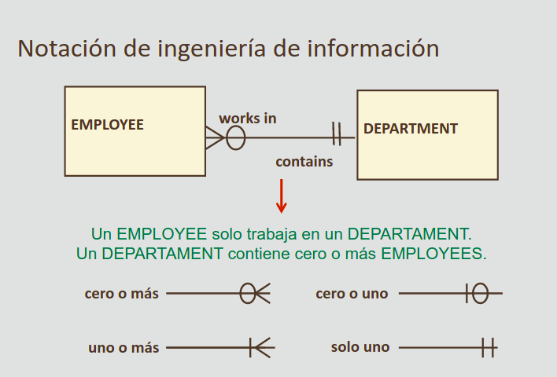

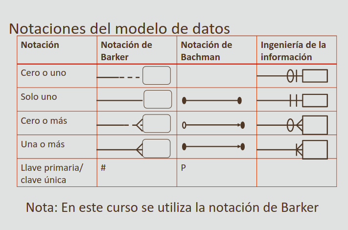

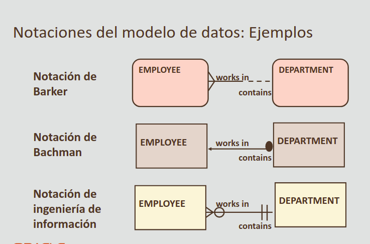

**Identificadores Unicos (UID)**

Un identificador unico es un atributo de una entidad que cumple las siguientes reglas:

- Es unico en tdas las instancias de la entidad
- Tiene un valor no null para cada instancia de la entidad en el tiempo que dura la instancia
- Tiene un valor que nunca cambia en el tiempo que dura la instancia

Un UID es un atributo especial o un grupo de atributos que identifica de forma unica una instancia concreta de una entidad.

Cada entidad debe tener un identificador unico, de lo contrario no es una entidad

**UID simples frente a UID compuestos**

Un UID que es un solo atributo es un UID simple, en algunas ocasiones un unico atributo no es suficiente para identificar de forma unica una instancia de una entidad

Si el UID es una combinacion de atributos, se denomina UID compuesto.

Identificador unico artificial: se crea a partir de datos que asigna o genera el sistema, los UID artificiales no se producen de forma natural pero se crean con fines de identificacion en un sistema

**Identificadores unicos candidatos**

Una entidad puede tener mas de un UID, pero solo se puede elegir uno de los UID como primario, los demas candidatos se denominan UID secundarios.

**Llave Primaria**

Un UID se convierte en llave primaria cuando el modelo lógico se transforma en una base de datos fisica

La llave primaria es una columna o un juego de columnas que indentifica de forma unica cada fila de una tabla, la misma no puede contener valores nulos, tambien debe contener un valor unico para cada fila de datos.

**Relaciones**

Una relacion es una asociacion bidireccional y significativa entre dos entidades o entre una entidad y ella misma

La linea de relacion del diagrama puede ser solida (obligatoria) o discontinua (opcional), estas lineas terminan en una unica punta (una instancia) o una "pata de gallo" (una o mas instancias).

las relaciones tienen nombres que ayudan a describir la conexion entre las entidades

**Clave foranea**

Las relaciones en un modelo de datos conceptual se asignan a claves foraneas en una tabla de base de datos fisica, una clave foranea es una columna o una combinacion de columnas de una tabla que hace referencia a una llave primaria en la misma tabla o en otra tabla.

**Componentes de una relacion**

Los componentes de la relacion incluyen lo siguiente:

- Nombre: Etiqueta que aparece junto a la entidad a la que está asignada
- Cardinalidad: Numero minimo y maximo de los valores de la relacion
- Opcionalidad: Si la relacion debe existir

¿En que consiste la opcionalidad en una relacion?

Las relaciones son obligatorias u opcionales

¿En que consiste la cardinalidad en una relacion?

La cardinalidad mide la cantidad de algo, en un relacion determina el grado de la relacion de una entidad con otra respondiendo a la pregunta "¿cuantos?"

**Tipos de relaciones**

Todas las relaciones representan los requisitos de informacion y las reglas del negocio

- De varios a uno (M:1) o de uno a varios (1:M)
- De varios a varios (M:M)
- De uno a uno (1:1)

**Matriz de relaciones: Recopilacion de informacion**

Una matriz de relaciones tiene las siguientes caracteristicas:

- Una matriz de relaciones muestra si cada entidad de fila de la parte izquierda de la matriz se relaciona con cada entidad de columna que se muestra en la parte superior de la matriz y como lo hacen
- Todas las entidades se muestran en la parte izquierda y suuperior de la matriz
- Si una entidad de fila se relaciona con una entidad de columna, el nombre de esa relación se muestra en el cuadro de interseccion
- Si una entidad de fila no se relaciona con una entidad de columna el cuadro de interseccion esta vacio
- Cada relacion por encima de la linea diagoonal es la imagen inversa o duplicada de una relacion por debajo de la linea
- Las relaciones recursivas se representan con los cuadros en la diagonal

**Modelado de relacion de entidades**

El modelo conceptual de base de datos se puede utilizar para discusiones posteriores mas detalladas entre los diseñadores, administradores de base de datos y desarrolladores de aplicaciones

**Objetivo del modelado conceptual**

Un modelo conceptual es importante para un negocio porque:

- Describe necesidades exactas de informacion del negocio
- Facilita la comunicacion
- Evita errores y malentendidos
- Crea una base solida para el diseño de la base de datos fisica
- Documenta los proceso (también denominados reglas de negocio) del negocio
- Tiene en cuenta las normativas y leyes vigentes en este sector

Un modelo conceptual es un modelo formal que:

- Describe los elementos importantes para una organizacion (entidades)
- Identifica las relaciones de nivel superior entre distintas entidades, pero puede o no inclluir la cardinalidad y la nulidad
- No especifica los atributos o el identificador unico de cada entidad

**Modelado logico**

El modelo de datos logico describe los datos con tantos detalles como sea posible, sin tener en cuenta como se implantaran fisicamente en la base datos, normalmente se deriva de un modelo de datos conceptual, incluye todas las entidades, atributos, UID y relaciones ademas de la opcionalidad y la cardinalidad de estos elementos

El modelo logico se ilustra con un ERD

Pasos para crear un modelo logico:

- Identificar las entidades
- Identificar los atributos
- Identificar los identificadores unicos
- Determinar las relaciones 

**Diagrama de relacion de entidad (ERD)**

Un ERD es un modelo que identifica los conceptos o las entidades que existen en un sistema y las relaciones entre esas entidades, funciona como herramienta de documentacion y se utiliza para comunicar la estructura logica de la base de datos a los usuarios.

**Modelos sin implantacion**

Un buen modelo de datos logico sigue siendo el mismo independientemente del tipo de sistema de base de datos que finalmente se incorpore o implante, esto es lo que se entiende por modelo sin implantacion

**Modelo de relacion de entidad (ERM)**

Este se deriva de las especificaciones de negocio y su objetivo consiste en crear una imagen clara de la informacion que se almacena en una futura base de datos

Se trata de una lista de todas las entidades y atributos, asi como todas las relaciones entre las entidades que son importantes

Tiene como objetivos:

- Capturar toda la informacion necesaria
- Asegurarse de que la informacion solo aparece una vez
- No modelar ninguna informacion derivada de otra informacion que ya esté modelada
- Localizar informacion en un lugar previsible y logico

Pasos para crear un ERD:

- Crear entidades y atributos
- Seleccionar identificadores unicos
- Crear relaciones
- Identificar la opcionalidad y la cardinalidad
- Comprobar el modelo

**ERDish** es el termino que se utiliza para comunicar con claridad las relgas de negocio capturadas en un ERD, utilice un lenguaje ERDish para indicar las relaciones entre entidades, solo hay que desglosar cada sentencia en sus componentes

Componentes de ERDish:

- EACH
- Entidad A
- OPTIONALITY (must be / may be)
- RELATIONSHIP NAME
- CARDINALITY (one and only one / one or more)
- Entidad B

## Seccion 3

**Mas sobre las relaciones**

Una entidad se puede identificar unicamente a traves de varias relaciones

**Relaciones M:M**

Los atributos solo describen entidades, si los atributos describen una relacion, esta se debe resolver

**Caracteristicas de la entidad de interseccion**

- Las relaciones de la entidad de interseccion son siempre obligatorias
- Suelen contener consumibles como la cantidad utilizada y las fechas, tienden a ser entidades de gran volumen y volatiles
- Se identifica por sus dos relaciones de origen (relaciones de identificacion)

**Relaciones no transferibles**

- La transferabilidad es la capacidad que tiene una entidad de cambiar a lo largo del tiempo entre dos instanciias
- Una relacion no transferible no se puede transferir entre las instancias de las entidades que conecta
- Una relacion no transferible se representa mediante un diamante en la relacion
- Las relaciones no transferibles solo pueden ser obligatorias

> Por ejemplo el pais de nacimiento de una persona no es transferible

**Entidades superype y suntype**

Supertype tiene una relacion principal-secundario con uno o mas subtipos

Subtype sera un sub agrupamiento de la entidad en un tipo de entidad que tiene atributos que se diferencian de otros subagrupamientos

Un subtipo puede tener y por lo general tendra sus propios atributos y relaciones, no habra nunca un subtipo unicamente; debe crearse otro subtipo que contenga el resto

Un subtipo:

- Hereda todos los atributos del supertipo
- Hereda todas las relaciones del supertipo
- Normalmente tiene sus propios atributos o relaciones
- Se representa graficamente dentro del supertipo
- Nunca existe en solitario
- Puede tener sus propios subtipos
- Tiene claves primarias identicas a las del supertipo y el subtipo

**Generalizacion**

Es un enfoque ascendente donde dos o mas entidades de nivel inferior se combinan para formar una entidad de nivel superior en funcion de las caracteristicas comunes

**Especializacion**

Es un enfoque descendente donde la entidad de nivel superior se desglosa en entidades de nivel inferior

**Relaciones recursivas**

Una relacion recursiva es aquella en la que una instancia de entidad se relacion con otra de la misma entidad

**Relacion de arco**

Un arco es un grupo de relaciones exclusivas, que se define de forma que solo puede existir una de las relaciones para cualquier instancia de una entidad.

El arco que se traza entre dos relaciones las conecta y demuestra que se excluyen entre si

La relacion implica una condicion "or"

El arco indica que cualquier instancia de esa entidad puede tener solo una relacion de la relacion en el arco en cualquier momento dado

Caracteristicas:

- Las relaciones de un arco normalmente tienen el mismo nombre de la relacion
- Las relaciones de un arco deber ser o bien todas obligatoras o bien todas opcionales, ademas de tener la misma cardinalidad
- Un arco pertenece a una sola entidad y solo debe incluir las relaciones que se originen en la entidad
- La entidad puede tener varios arcos pero en una relacion concreta solo puede participar en un unico arco
- Una relacion de arco se representa como una linea en forma de arco entre dos o mas lineas de una relacion

**Normalizacion**

Es el proceso de organizar los atributos y las tablas de una base de datos relacional para minimizar la redundancia, esto ayuda en el manejo de anomalias de insercion, actualizacion y supresion, garantizando un mejor rendimiento de la base de datos

**Tipos de formatos normales**

- Primer formato normal: Necesita que no existan atributos de varios valores
- Segundo formato normal: Necesita que cualquier atributo que no sea UID dependa de (sea propiedad de o una caracteristica de) todo el UID, si el UID es compuesto, cada atributo debe de depender de todas las partes del UID compuesto
- Tercer formato normal: Indica que ningun atributo que no sea UID puede depender de otro atributo que no sea UID, este formato prohibe las dependencias transitivas, debe mover cualquier atributo no UID que depende de otro atributo no UID a una nueva entidad

## Seccion 4

**Introduccion a Oracle SQL Developer Data Modeler**

Oracle SQL Developer Data Modeler ofrece una amplia gama de capacidades de modelado de datos y bases de datos, que le permite:

- Capturar reglas de negocion e informacion
- Crear modelos de proceso, logicos, relacionales y fisicos
- Almacenar informacion de metadatos en archivos XML
- Sincronicar el modelo relacional con el diccionario de datos

**Creacion de un ERD mediante Oracle SQL Developer**

- Cree entidades
- Agregue atributos y UID
- Defina la relacion entre entidades
- Defina los valores de origen y los valores de destino de la relacion

**Enfoques del modelado de datos**

Hay 3 enfoques del modelado de datos:

- El modelado de arriba abajo es el enfique adoptado para diseñar una base de datos nueva.
- El modelado de abajo arriba es el enfoque utilizado para crear una base de datos basada en la extranccion de metadatos de una base de datos existente o mediante el codigo de lenguaje de definicion de datos (DDL) obtenido de la implantacion de una base de datos existente
- El modelado de destino es el mas adecuado para adaptar una base de datos a nuevos requisitos

**Ingenieria de un modelo de datos**

La ingenieria directa es el proceso de transformación de un modelo de datos logico en un modelo relacional.

- En Oracle SQL Developer Data Modeler, se representa un modelo fisico mediante un modelo relacional
- La ingenieria inversa es el proceso de creacion de un modelo logico o conceptual mediante la extraccion de informacion de un origen de datos existente

**Ventajas de crear un modelo relacional**

Un modelo relacional:

- Se parece mas a la solucion de implantacion
- Facilita la comunicacion
- Constituye la base del diseño de la base de datos fisica

El modelo ideal se puede adaptar a un modelo de sistema de gestion de base de datos relacionales (RDBMS)

**Terminologia**

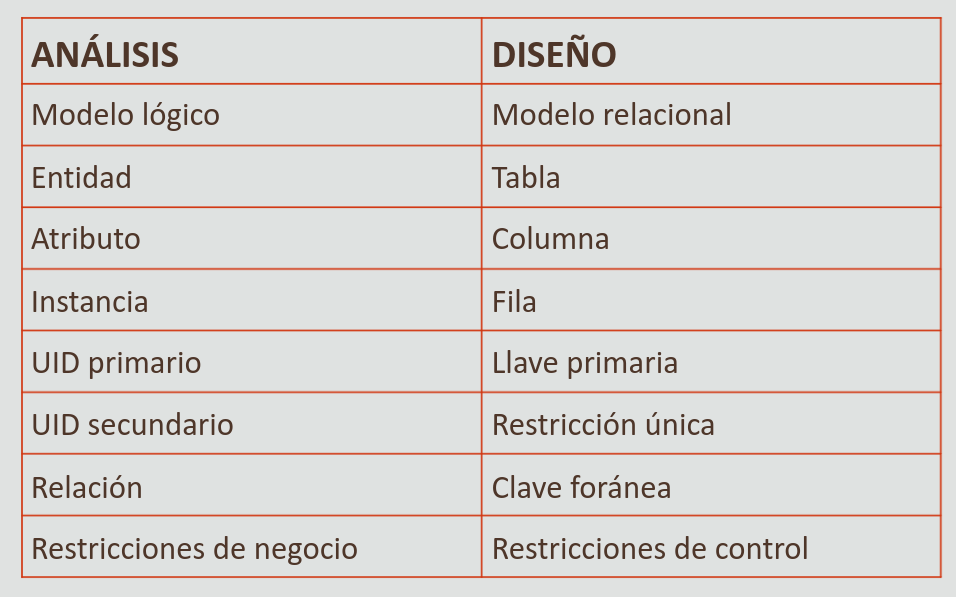

## Seccion 5

**Asignacion de entidades y atributos**

Un modelo físico:

- Es el plan detallado para la implantacion real de la base de datos
- Se puede utilizar como base para implantación de cualquier tipo de DBMS
- El modelo ideal se puede adaptar a un modelo de RDBMS
- En oracle sql developer data modeler, a un modelo fisico se le denomina relacional.

**Reglas de Nomenclatura**

Decida las convenciones para:

- **Nombres de tablas:** El plural del nombre de la entidad se utiliza generalmente como el nombre de la tabla correspondiente
- **Nombres de columna y caracteres especiales:** Los nombres de columna suelen ser identicos a los nombres de atributo con algunas excepciones, reemplace los caracteres especiales por caracteres de subrayado, porque SQL no permite que se utilice la mayoria de caracteres especiales en los nombres de columna. Los nombres de columna suelen estar abreviados.
- **Nombres abreviados de tabla (abreviaturas):** Una abreviatura unica para cada tabla es un elemento muy util para la nomenclatura de columnas de clave ajena o restricciones de clave ajena

**Restricciones de nomenclatura**

- Nombres de tabla y columna: Deben empezar por una letra, pueden contener hasta 30 caracteres alfanumericos, no pueden contener espacios ni caracteres especiales, deben evitar las palabras reservadas.
- Los nombres de tabla deben ser unicos en un esquema
- Los nombres de columna deben ser unicos en una tabla

**Glosario**

-  Un glosario en data modeler es un juego de terminos aceptados que se pueden utilizar en el diseño
-  Garantiza que el modelo cumpla los estandares de nomenclatura definidos o que lo haga al realizar la conversion entre los modelos logico y relacional
-  Puede crear un glosario nuevo, utilizar glosarios existentes o bien generar un glosario basado en un modelo logico existente

Puede crear un glosario a partir del modelo logico existente. resulta mas sencillo y rapido que crear un nuevo glosario, ya que los nombres de atributo y entidad del modelo logico se agregan automaticamente

**Asignacion de llave primaria y clave foranea**

**Reglas de nomenclatura**

- Las restricciones aplican a las reglas y garantizan la consistencia e integridad de la base de datos
- las restricciones deben tener nombres significativos para que se les pueda hacer referencia facilmente

**Reglas de nomenclatura para restricciones de llave primaria**

- A las restricciones de llave primaria se les asigna un nombre mediante el nombre de la tabla abreviada, un guion bajo y el sufijo PK

**Reglas de nomenclatura para restricciones de clave foranea**

- a las restricciones de clave foranea se les asigna un nombre mediante los nombres de dos tablas abreviados, un guion bajo y el sufijo FK

**Reglas de nomenclatura para columnas de clave foranea**

- a las columnas de clave foranea se les asigna un nombre mediante los nombres de la tabla y de la columna abreviados y las referencias de clave foranea

**Aplicacion de estandares de nomenclatura en Oracle SQL Developer Data Modeler**

- Por defecto, los nombres de restricciones se crean mediante el nombre completo de la tabla en Oracle SQL Developer Data Modeler, esto puede hacer uqe los nombres de restricciones sean muy largos, dificiles de gestionar y que superen el numero maximo de caracteres permitidos en SQL

## Seccion 6

**Introduccion a Oracle Application Express**

Las computadoras han existido durante mucho tiempo, pero su uso en el ambito personal y de los negocios no se produjo hasta que se desarrollaron los programas de software de aplicaciones

Los programas de aplicaciones permitian al usuario final comprar programas completamente desarrollados y listos para usar, ya no era necesario conocer el funcionamiento del programa, bastaba con saber que funcionaba y que realizaba la funcion que deseabamos

**Oracle Application Express**

Es una herramienta de desarrollo, despliegue y mantenimiento de aplicaciones web

**Componentes de Oracle Application Express**

Tiene los siguientes componentes:

- Taller de SQL
- Creador de aplicaciones
- Explorador de objetos

Para obtener mas informacion sobre SQL, utilizara el componente worshop

Para diseñar una aplicacion, utilizara Application Buildes

Para obtener instrucciones sobre el uso de APEX, consulte la guia del alumno de iAcademy en el member hub

**Lenguaje de Consulta Estructurado**

¿Como se organizan los datos en bases de datos relacionales?

Los datos se almacenan en una matriz bidimensional conocida como tabla

**Relacion de varias tablas**

- Cada fila de  datos de una tabla se puede identificar de forma unica mediante una llave primaria
- Puede relacionar datos de forma logica desde varias tablas mediante claves foraneas

En una base de datos relacional no es necesario especificar la ruta de acceso a las tablas y tampoco es necesario saber como se organizan los datos de forma fisica

Para acceder a la base de datos, ejecuta una sentencia SQL, que es el lenguaje estandar de ANSI (American National Standars institute) para el funcionamiento de las bases de datos relacionales

SQL es compatible con el estandar ISO (SQL 1999)

**¿Que es SQL?**

El lenguaje de consulta estructurado (SQL) es el lenguaje declarativo basado en juegos utilizado para acceder a los datos de una base de datos ORACLE

SQL proporciona una interfaz para una base de datos relacional y proporciona las sentencias que ayudan a trabajar con la base de datos

SQL es:

- Eficiente, facil de aprender y de utilizar
- Funcionalidad completa (con SQL, puede definir, recuperar y manipular datos en las tablas)

**Funciones SQL**

- Creacion, sustitucion, modificacion y borrado de objetos de base de datos
- Insercion, actualizacion y supresion de filas en una tabla
- Consulta de datos almacenados en la base de datos
- Control de acceso a la base de datos y los objetos de base de datos
- Garantia de integridad y consistencia de la base de datos

**Tipos de comando SQL**

**DDL** (Lenguaje de definicion de datos): Define estructuras de bases de datos

**DML** (Lenguaje de manipulacion de datos): Manipula los datos (INSERT, UPDATE, DELETE)

**DQL** (Lenguaje de consulta de datos): Selecciona los datos (SELECT)

**DCL** (Lenguaje de control de datos): Controla el acceso de usuario

**TCL** (Lenguajes de control transaccional): Gestiona las transacciones de bases de datos

**Procesamiento SQL**

Fases del procesamiento:

- Analisis
- optimizacion
- Generacion del origen de la  fila
- Ejecucion

**Acceso a los datos en el servidor de Oracle Database**

Herramientas especializadas instaladas en las computadoras de los usuarios les permiten acceder a los datos en el servidor de oracle database. Estas herramientas se denominan clientes y se utilizan para enviar instrucciones SQL (Comandos) al servidor.

Tres de estas herramientas son:

- SQL*Plus
- Oracle Application Express (APEX)
- Oracle SQL Developer

**DDL**

Objetos de la base de datos

- Tabla: Es la unidad basica de almacenamiento; consta de filas
- Vista: Representa de forma logica subjuegos de datos de una o mas tablas
- Secuencia: Genera valores numericos
- Indice: Mejora el rendimiento de algunas consultas
- Sinonimo: Ofrece un nombre alternativo para un objeto

**Reglas de nomenclatura para tablas y columnas**

Los nombres de tabla y de columna deben:

- Empezar por una letra
- Tener entre 1 y 30 caracteres
- Contener solo A-Z, a-z, 0-9, _, $ y #
- No ser un duplicado de otro nombre de objeto propiedad del mismo usuario
- No ser una palabra reservada del servidor de oracle

**Sentencia CREATE TABLE**

Para emitir una sentencia CREATE TABLE, se debe disponer de lo siguiente:

- El privilegio CREATE TABLE
- Un area de almacenamiento

Especifique la sentencia:

- Nombre de la tabla
- Nombre de columna, tipo de dato de columna, tamaño de columna
- Restricciones de integridad (opcional)
- Valores por defecto (opcional)

Para confirmar que se ha creado de la tabla, ejecute el comando DESCRIBE

**Tipos de dato**

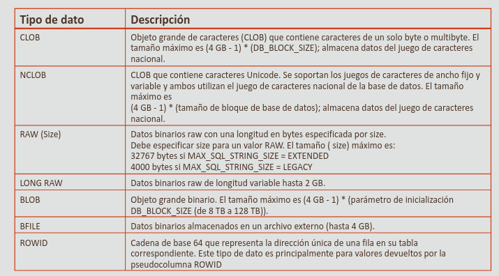
![tipo de datos fecha] (img/tdatos2.png)

**Opcion DEFAULT**

Especifica un valor por defecto para una columna durante la operación CREATE TABLE

Esta opcion evita que se intriduzcan valores nulos en las columnas si se insert una fila sin un valor para la columna

> ... hire_date DATE DEFAULT SYSDATE, ...

Los valores literales, expresiones o funciones SQL son valores validos

El nombre de otra columna o una pseudocolumna son valores no validos

El tipo de dato por defecto debe coincidir con el tipo de datos de la columna

**Inclusion de restricciones**

- Las restricciones aplican reglas en el nivel de tabla
- Las restricciones garantizan la consistencia e integridad de la base de datos
- Los siguientes tipos de restricciones son validos: NOT NULL, UNIQUE, PRIMARY KEY, FOREIGN KEY, CHECK

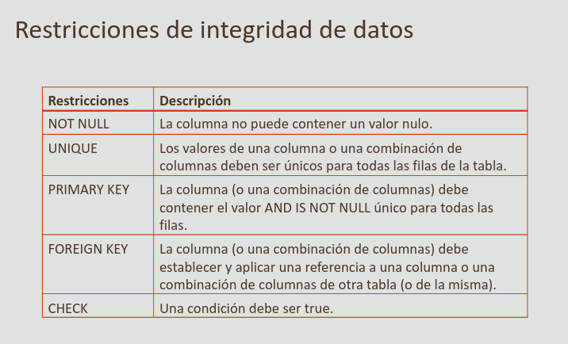

**Directrices de restriccion**

- Asignar un nombre a una restriccion (de lo contrario el servidor oracle genera un nombre con el formato SYS_Cn)
- Es facil hacer referencia a las restricciones si se les asigna un nombre significativo (por ejemplo, employee_employee_id_pk)
- Crear una restricción en uno de los siguientes momentos:
	- En el momento de la creación de la tabla
	- Despues de la creacion de la tabla
- Definir una restriccion en el nivel de columna o de tabla
- Ver una restriccion en el diccionario de datos
- Las restricciones de nivel de columna se incluyen al definir la columna
- Las restricciones de nivel de tabla se definen al final de la definicion de tabla y deben hacer referencia a la columna o las columnas a las que pertenece la restriccion
- Funcionalmente, una restriccion de nivel de columna no es lo mismo que una restriccion de nivel de tabla
- Las restricciones NOT NULL solo se pueden definir en el nivel de columna
- Las restricciones que se aplican a mas de una columna se deben especificar en el nivel de tabla

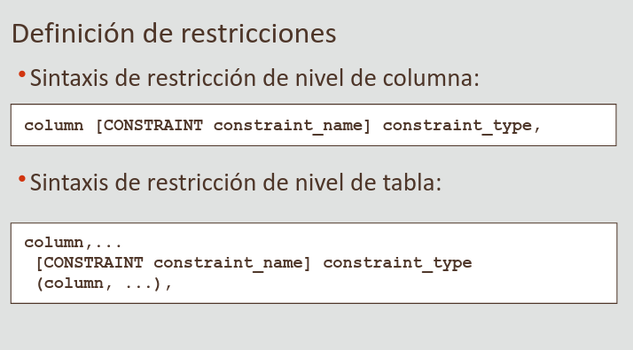

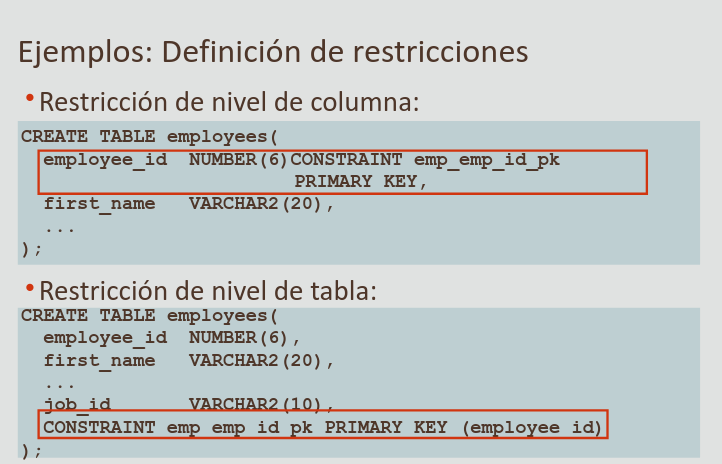

**Restriccion NOT NULL**

Garantiza que no se permiten los valores nulos para la columna, solo se puede definir en el nvel de columna

**Restriccion UNIQUE**

Una restriccion de integridad de clave UNIQUE requiere que todos los valores de la columna o de un juego de columna sean unicos

Si la restriccion UNIQUE tiene mas de una columna, el grupo de columnas se denomina clave unica compuesta

Las restricciones UNIQUE permiten la entrada de valores nulos

Un valor nulo en una columna (o en todas las columnas de una clave UNIQUE compuesta) cumple siempre una restriccion UNIQUE

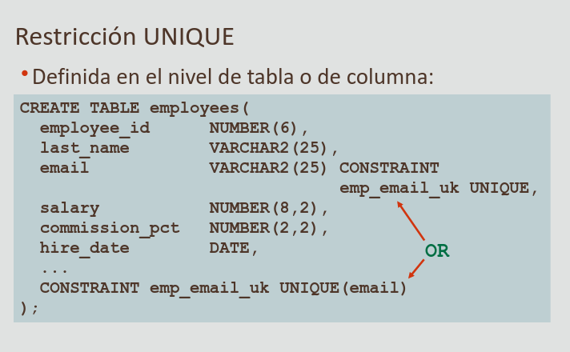

**Restriccion PRIMARY KEY**

Una restriccion PRIMARY KEY crea una llave primaria para la tabla

Solo se puede crear una llave primaria para cada tabla

La restriccion PRIMARY KEY es una columna o un juego de columnas que identifica de forma unica cada fila de una tabla

Ninguna columna que forme parte de la llave primaria puede contener un valor nulo

Se debe crear una llave primaria compuesta en el nivel de la tabla

**Restriccion FOREIGN KEY**

La restriccion FOREIGN KEY (o integridad referencial) designa una columna o una combinacion de columnas como clave foranea

Establece una relacion con una llave primaria en la misma tabla o en una diferente

Directrices para las restricciones de clave foranea:

- El valor de clave foranea debe coincidir con un valor existente de la tabla principal o ser un valor NULL
- Las claves foraneas se basan en los valores de datos y son punteros puramente logicos, en lugar de fisicos

**Restriccion FOREIGN KEY: Palabras clave**

- FOREIGNN KEY: Define la columna en la tabla secundaria en el nivel de restriccion de tabla
- REFERENCES: Identifica la tabla y la columna en la tabla principal
- ON DELETE CASCADE: Suprime las filas dependientes de la tabla secundaria cuando se suprime una fila de la tavla principal
- ON DELETE  SET NULL: Convierte los valores clave foranea dependiente en nulos

**Restriccion CHECK**

Define una condicion que debe cumplir cada fila

No puede hacer referencia a columnas de otras tablas

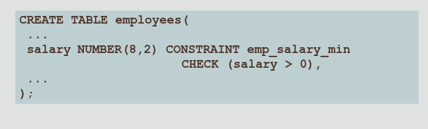

**Lenguaje de definicion de datos**

La creacion de tablas forma parte del lenguaje de definicion de datos SQL

Entre otras sentencias DDL se incluyen:

- ALTER: Para modificar la estructura de un objeto
- DROP: Para eliminar un objeto de la base de datos
- RENAME: Para cambiar el nombre de un objeto de base de datos

**Sentencia ALTER TABLE**

Utilice la sentencia ALTER TABLE para cambiar la estructura de la tabla:

- Agregar una columna
- Modificar una definicion de columna existente
- Definir un valor por defecto para la nueva columna
- Borrar una columna
- Cambiar el nombre de una columna
- Cambiar una tabla al estado de solo lectura

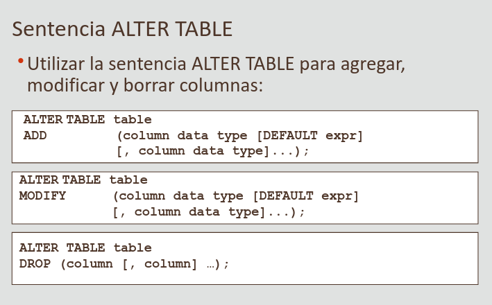

**Opcion SET UNUSED**

La opcion SET UNUSED marca una o mas columnas como no utilizadas para que se puedan borrar simultaneamente cuando la demanda de recursos del sistema sea menor

Puede utilizar la opcion SET UNUSED para marcar una o mas columnas como no utilizadas

Puede utilizar la opcion DROP UNUSED COLUMNS para eliminar las columnas marcadas como no utilizadas

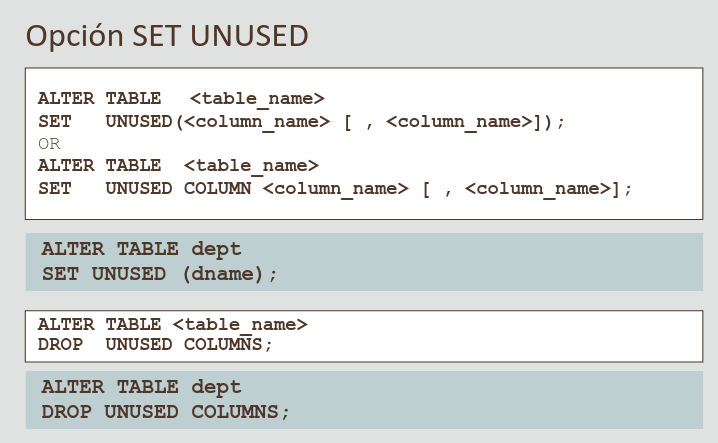

**Tablas de solo lectura**

Puede utilizar la sintaxis de ALTER TABLE para:

- Definir una tabla en modo de solo lectura para evitar cambios de DDL o DML durante el mantenimiento de la tabla
- Volver a definir la tabla en modo de lectura/escritura

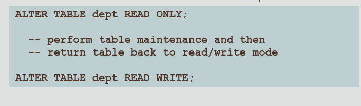

**Borrado de una tabla**

- Mueve una tabla a la papelera de reciclaje
- Elimina la tabla y sus datos si se especifica la clausula PURGE
- Invalida los objetos dependientes y elimina los privilegios de objeto en tabla

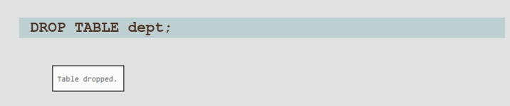

**DML**

Las sentencias DML se ejecutan al:

- Agregar nuevas filas a una tabla (INSERT)
- Modificar filas existentes en una tabla (UPDATE)
- Eliminar filas existentes de una tabla (DELETE)

Una transaccion consta de recopilacion de sentencias DML que forman una unidad logica de trabajo

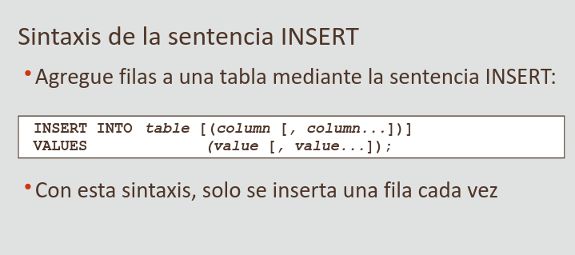
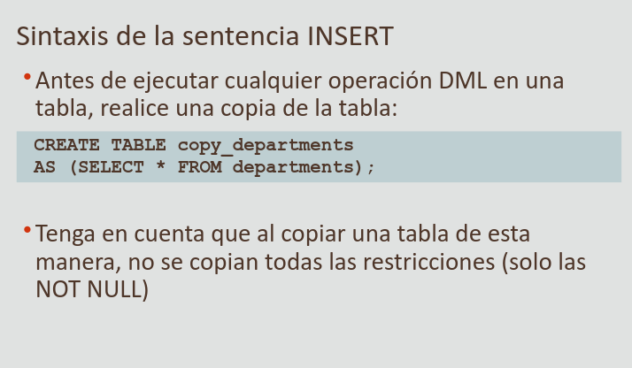

**insercion de filas**

Si inserta una fila que contiene valores para cada columna, noes necesaria la lista de columnas en la clausula INSERT

Mostrar valores en el orden por defecto de las columnas de la tabla

Se debe proporcionar un valor para cada columna

Opcionalmente, enumere las columnas en la clausula INSERT

Enumere los valores en el mismo orden en que aparecen en los campos

Delimite los valores de caracteres y de flecha entre comillas simples

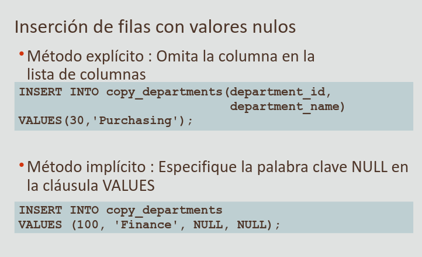

**Insercion de valores especiales**

Puede utilizar funciones para introducir valores especiales en la tabla

La funcion SYSDATE registra la fecha y la hora actuales

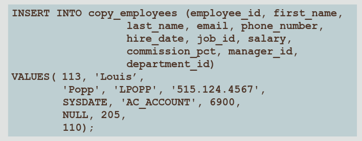

**Sintaxis de la sentencia UPDATE**

Modifique los valores existentes en una tabla con la sentencia UPDATE:

En general utilice la columna de llave primaria en la clausula where para identificar una unica fila para la actualizacion

Actualice mas de una fila cada vez (si es necesario)

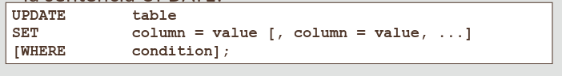

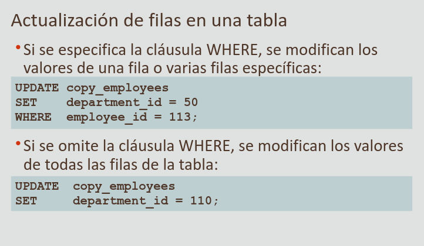

**Sentencia DELETE**

Puede eliminar filas existentes de una tabla mediante la sentencia DELETE

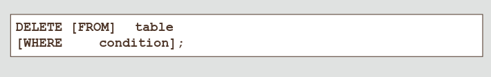

**Supresion de filas de una tabla**

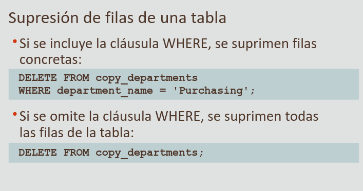

No se puede suprimir una fila que contenga una llave primaria utilizada como clave foranea en otra tabla

**Sentencia TRUNCATE**

Elimina todas las filas de una tabla, dejando la tabla vacía y la estructura de la misma intacta

Es una sentencia DDL mas que una sentencia DML; no se puede deshacer facilmente

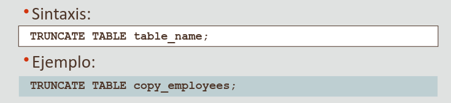

**TCL**

COMMIT, ROLLBACK y SAVEPOINT no estan soportados en Oracle Application Express, debido a la forma en que Oracle Application Express gestiona las conexiones a la base de datos

**Transacciones de Base de datos**

Las transacciones constan de sentencia DML que representan un cambio consistente en los datos

El servidor de Oracle garantiza la consistencia de los datos basada en transacciones

Las transacciones le proporcionan mas flexibilidad y control al cambiar los datos y garantizan la consistencia de los datos en caso de fallo de proceso de usuario o del sistema

Una transaccion de babse de datos consta de una de las siguiente sentencias:

- Sentencias DML que representan un cambio consistente en los datos
- Una sentencia DDL
- Una sentencia TCL

**Transacciones de base de datos: inicio y fin**

Una transaccion empieza cuando se ejecuta la primera sentencia SQL de DML

Termina con uno de los siguientes eventos:
- Se emite una sentencia COMMIT o ROLLBACK
- Se ejecuta una sentencia DDL o TCL (confirmacion automatica)
- El usuario sale del software SQL en uso
- El sistema falla

**Ventajas de las sentencia COMMIT y ROLLBACK**

Con las sentencias COMMIT y ROLLBACK, puede:

- Garantizar la consisencia
- Visualizar una presentacion preliminar de los cambios de los datos antes de hacerlos permanentes
- Agrupan componentes relaciones de forma logica
- Tener control sobre cambios permanentes de los datos

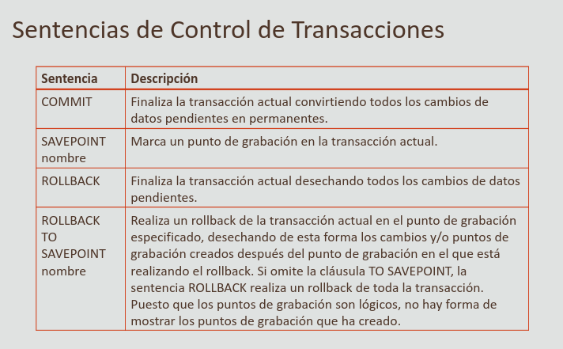

**Como deshacer cambios de un marcador**

Cree un marcador en una transaccion actual mediante la sentencia SAVEPOINT

Descarte cambios pendientes realizando rollback en dicho marcador mediante la sentencia ROLLBACK TO SAVEPOINT

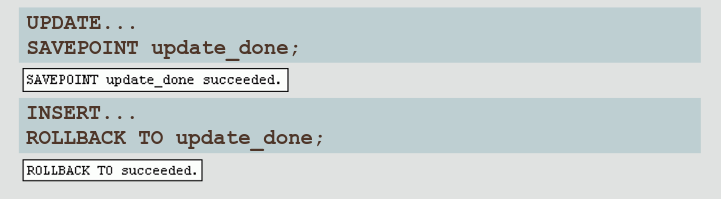

**Procesamiento de transacciones implicitas**

Una transaccion automatica se produce en las siguientes circunstancias:

- Se emite una sentencia DDL
- Se emite una sentencia TCL
- Hay una salida normal del software SQL, sin emitir explicitamente las sentencias COMMIT o ROLLBACK

Se produce un rollback automatico cuando hay una terminacion anormal del software SQL o cuando hay un fallo del sistema para proteger la integridad de la base de datos

**Estado de los datos antes de COMMIT o ROLLBACK**

Todos los cambios realizados durante una transaccion son temporales si no se confirman, por lo tanto, se puede recuperar el estado anterior de los datos

La sesion actual puede revisar los resultados de las operaciones DML mediante la sentencia SELECT

Las demas sesiones no pueden ver los resultados de las sentencias DML emitidas por la sesion actual

Las filas afectadas estan bloqueadas; otras sesiones no pueden cambiar los datos de las filas afectadas

**Estado de los datos despues de COMMIT**

Los cambios de datos se guardan en la base de datos

Se sobreescribe el estado anterior de los datos

Rodas las sesiones pueden ver los resultados

Lo bloqueos de las filas afectadas se liberan y dichas filas quedan disponivles para que las manipulen otras sesiones

Se borran todos los puntos de grabacion

**Confirmacion de datos**

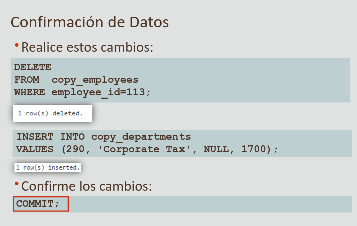

**Estado de los datos despues de ROLLBACK**

Deseche todos los cambios penndientes mediante la sentencia ROLLBACK:

- Se deshachen los cambios de datos
- Se restaura el estado anterios de los datos
- Se liberan los bloqueos de las filas afectadas

**Rollback a nivel de sentencia**

Si falla una sentencia DML durante la ejecucion, solo se realiza un rollback de ducha sentencia

El servidor de Oravle implementa un punto de grabacion implicito

Los demas cambios se retienen

El usuario debe terminar las transacciones explicitamente con la ejecucion de una sentencia COMMIT o ROLLBACK

**Consistencia de lectura**

La consistencia de lectura garantiza una vista consistente de los datos en todo momento. cada usuario ve los datos como estaban en la ultima sentencia COMMIT

Los cambios realizados por un usuario no entran en conflicto con los cambios realizados por otr usuario

La consistencia de lectura garantiza que en los mismos datos:

- Los lectores no esperen a los escritores
- Los escritores no esperen a los lectores
- Los escritores esperen a los escritores

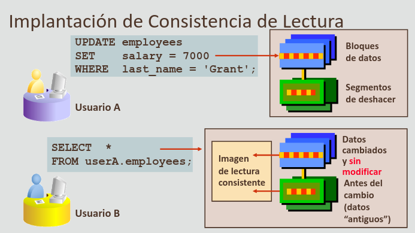

**Recuperacion de datos mediante SELECT**

**Sententencia SELECT básica**

SELECT identifica las columnas que se van a mostrar

FROM identifica la tabla que contiene esas columnas

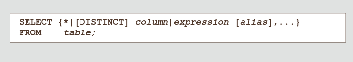

**Seleccion de todas las columnas**

Para ver todas las columnas de una tabla, coloque un * despues de la palabra clave SELECT

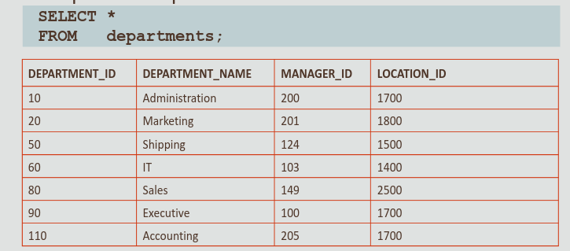

**Seleccion de columnas  concretas: proyeccion**

Puede utilizar la sentencia SELECT para mostrar columnas concretas de la tabla indicando los nombres de columna en el orden que desea verlas, separadas por comas

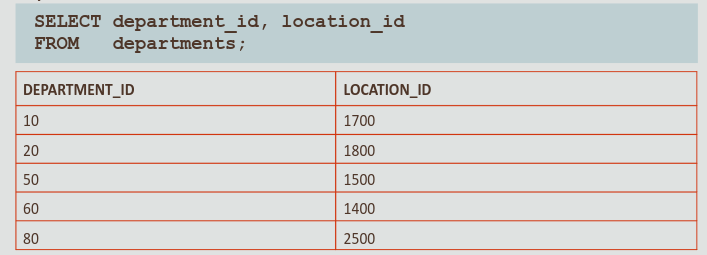

**Escritura de Sentencias SQL**

Con estas sencillas reglas y directrices que se muestran a  continuacion, puede construir sentencias validas que son faciles de leer y editar

- Las sentencias SQL no son sensibles a mayusculas/minusculas
- Las sentencias SQL se pueden introducir en una o mas  lineas
- Las palabras clave no se pueden abreviar o dividir entre lineas y suelen aparecer en mayuscula
- Las clausulas se suelen colocar en lineas independientes
- El sangrado se utiliza para mejjjorar la legibilidad
- En Application Epress, las sentencias SQL pueden termina con punto y coma (;), pero no es obligatorio

**Expresiones Aritmeticas**

Crear expresiones con datos de fecha y numeros mediante operadores aritmeticos

Los nombres de columna, constantes numericas y operadores aritmeticos se pueden utilizar en expresiones aritmeticas

Los operadores aritmeticos se pueden utilizar en cualquier clausula de sentencia SQL, excepto FROM

**Uso de operadores aritmeticos**

En este caso, el operador de suma se utiliza para calcular  un aumento de salario de 300$ para todos los empleados

SALARY + 300 se muestra como cabecera de columna

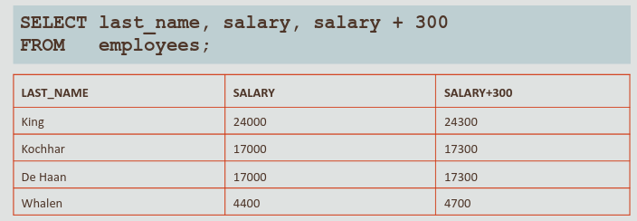

**Prioridad de operadores**

Utilices los parentesis para reforzar el orden estandar de prioridad y mejorar la claridad

Puede sustituir las reglas de prioridad utilizando parentesis para especificar el orden en el que se ejecutan los operadores

**Definicion de valor nulo**

Un valor nulo es un valor que no esta disponible, sin asignar, desconocido o que no es aplicable

Un valor nulo no es lo mismo que un cero o un espacio en blanco

**Valores nulos en expresiones aritmeticas**

Cualquier expresion aritmetica que contenga valores nulos se evalua como nula

**Definicion de alias de columna**

Una alias de columna:

- Cambia el nombre de una cabecera de columna
- Es util para realizar calculos
-  Sigue inmediatamente al nombre de columna (tambien puede ser  la palabra clave opcional AS entre el nombre de columna y el alias)
- Necesita comillas dobles si contiene espacios o caracteres especiales o si es sensible a mayusculas/minusculas

**Uso de alias de columna**

La palabra clave AS es opcional

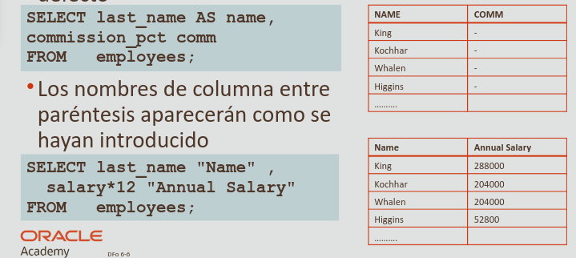

**Operador de concatenacion**

Enlaza columnas o cadenas de caracteres a otras columnas

Se representa con dos barras verticales (||)

Crea una columna que es una expresion de caracter

**Cadenas de caracteres literales**

Un literal es un caracter, un numero o una fecha que se incluye en la sentencia SELECT

Los valores literales de caracteres y fecha se deben incluir entre comillas simples

Cada cadena de caracteres es la salida una vez para cada fila devuelta

**Uso de cadenas de caracteres literales**

En el ejemplo, el apellido y el job_id de cada empleado se concatenan con un literal para proporcionar a las filas devueltas mas significado

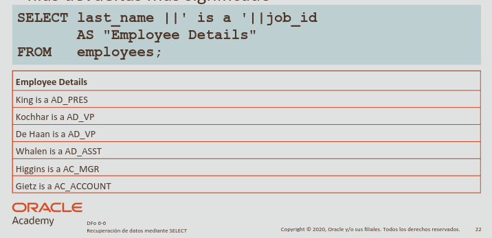

**Operador de comillas (q) alternativo**

Muchas de las sentencias SQL utilizan literales de caracteres en expresiones o condiciones. Si el propio literal contiene una comilla simple, puede utilizar el operador de comillas (q) y seleccionar su propio delimitador de entrecomillado, en este caso, los corchetes[]

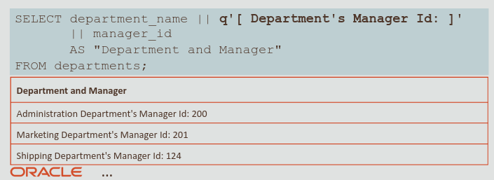

**Filas duplicadas**

La visualización por defecto de las consultas incluye todas las filas, tambien las filas duplicadas

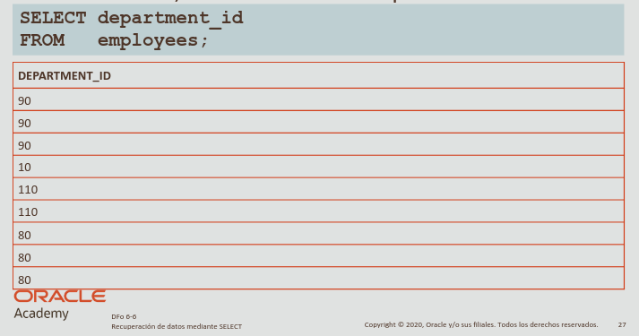

Para eliminar filas duplicadas en el resultado, incluye la palabra clave DISTINCT en la clausula SELECT inmediatamente despues de la palabra clave SELECT

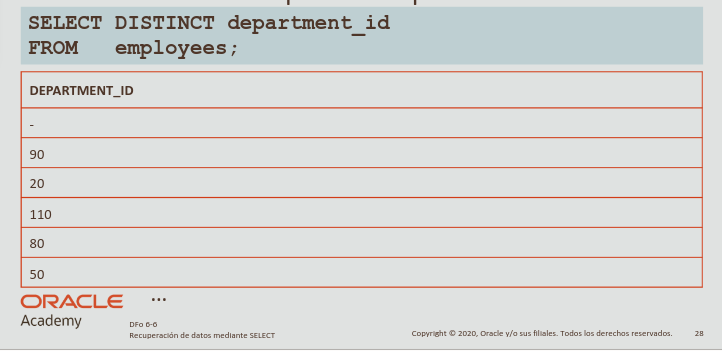

**Visualizacion de la estructura de la tabla**

Utilice el comando DESCRIBE para mostrar la estructura de una tabla, incluidos el nombre de columna, tipo de datos y nullidad

O seleccione el sxplorador de objetos de APEX en el taller de SQL para ver la estructura de la tabla

Puede hacer clic en el boton Buscar tablas en los comandos SQL de APEX para ver las estructuras de tablas tambien

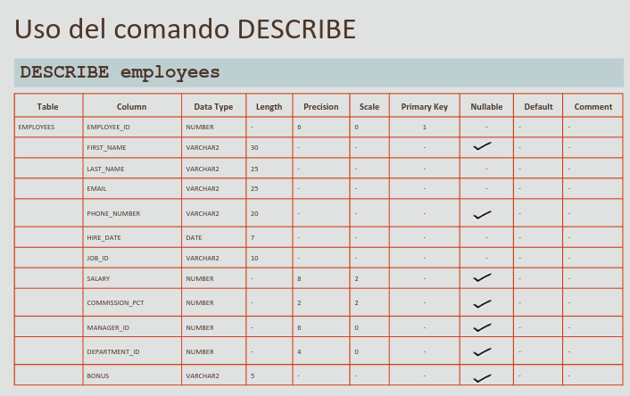

**Restriccion de datos mediante WHERE**

**Limitacion de las filas seleccionadas**

Restrinja las filas devueltas mediante la clausula WHERE:

Si la expresion logica se evalua como true, se devolvera la fila que cumpla con la condicion

La clausula WHERE sigue a la clausula FROM

**Fechas y cadenas de caracteres**

Las cadenas de caracteres y valores de fecha seincluyen entre comillas simples

Los valores de caracteres son sensibles a mayusculas/minusculas y los valores de datos son sensibles al formato

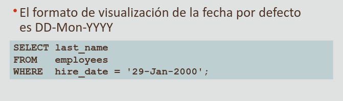

**Operadores de comparacion**

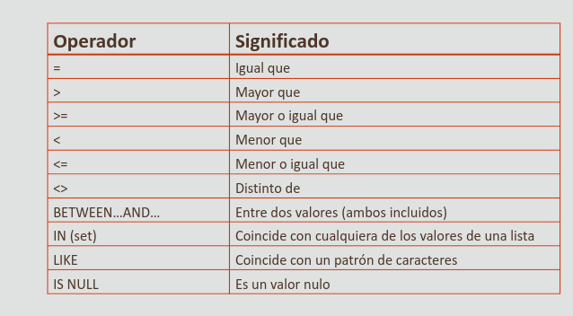

**Condiciones de rango: Operador BETWEEN**

Utilice el operador BETWEEN para mostrar filas basadas en un rango de valores:

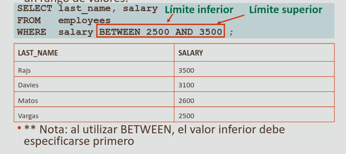

**Condiciones de la inscripcion: Operador IN**

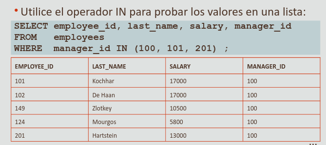

**Condiciones de la inscripcion: Operador NOT IN**

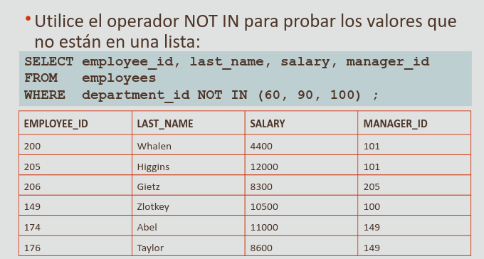

**Coincidencia de Patrones: Operador LIKE**

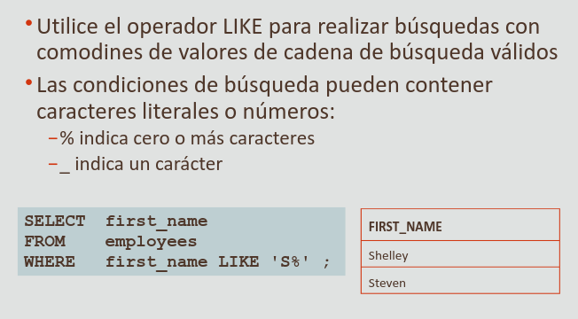

**Combinacion de Caracteres Comodin**

Puede combinar los dos caracteres comodin (%, _) con caracteres literales para la coincidencia de patrones:

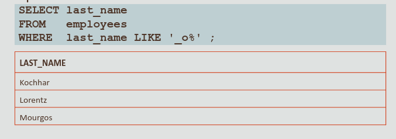

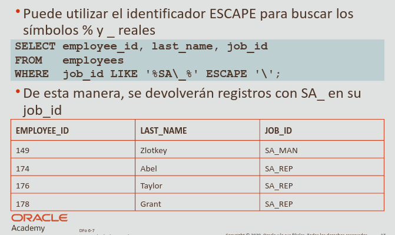

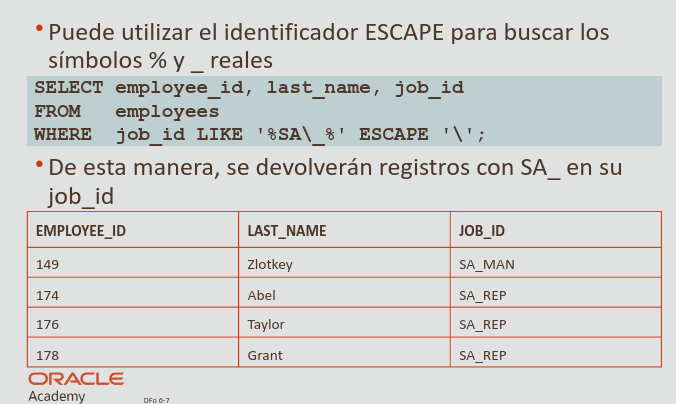

**Uso de las condiciones NULL**

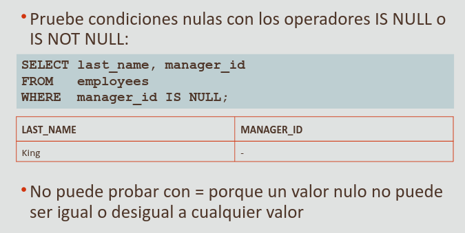

**Definicion de Condiciones mediante los operadores logicos**

Una condicion logica combina el resultado de dos condiciones de componente para producir un resultado unica basado en dichas condiciones o invierte el resultado de una conndicion unica si se utiliza NOT

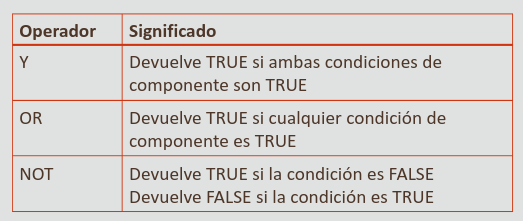

**Uso del operador AND**

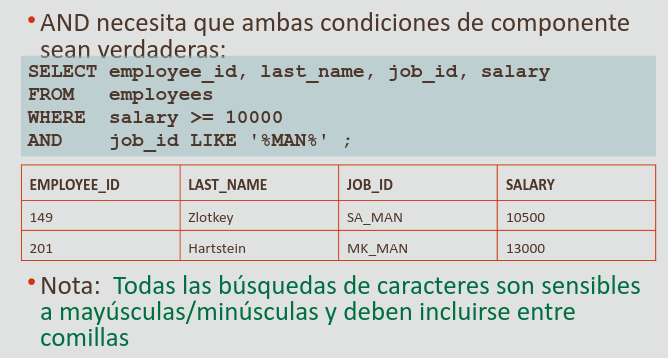

**Uso del operador OR**

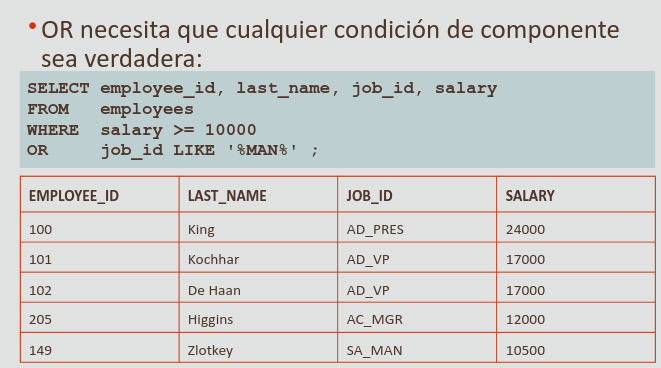

**Uso del operador NOT**

NOT invierte el valor de la condicion:

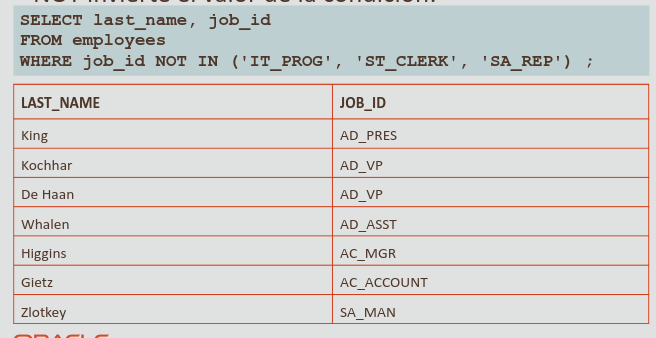

**Reglas de precedencia**

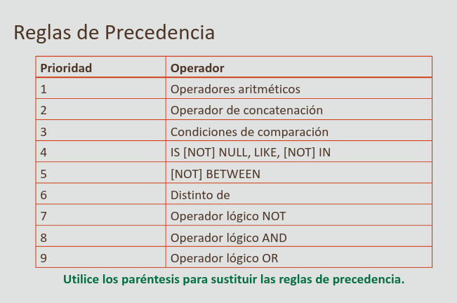

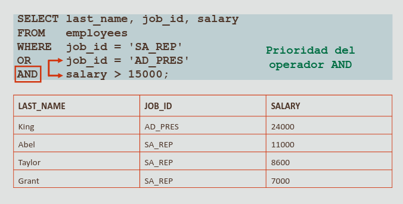

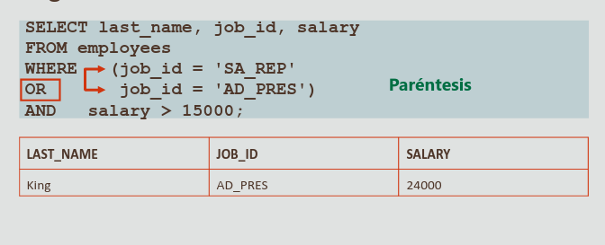

**Ordenacion de datos mediante ORDER BY**

**Uso de la clausula ORDER BY**

Ordene las filas recuperadas con la clausula ORDER BY:

- ASC: Orden ascendente (valor por defecto)
- DESC: Orden descendente

La clausula ORDER BY es la ultima en la sentencia SELECT:

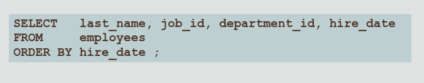

**Clausula ORDER BY**

Los valores numericos se muestran del mas bajo al mas alto

Los valores de fecha se muestran con el valor mas reciente en primer lugar

Los valores de caracteres se muestran en orden alfabetico

Los valores nulos se muestran los ultimos en orden ascendente y los primeros si el orden es descendente

NULLS FIRST especifica que los valores NULL se deben devolver antes que los valores que no son NULL

NULLS LAST especifica qque los valores NULL se deben devolver despues que los valores que no son NULL

**Orden**

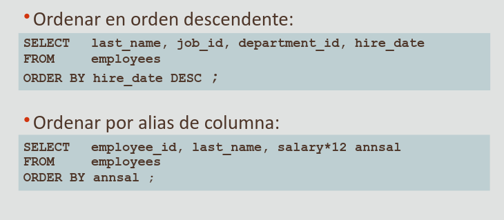

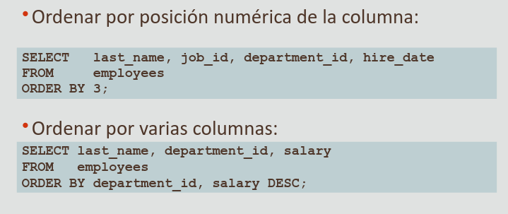

**Orden de ejecucion**

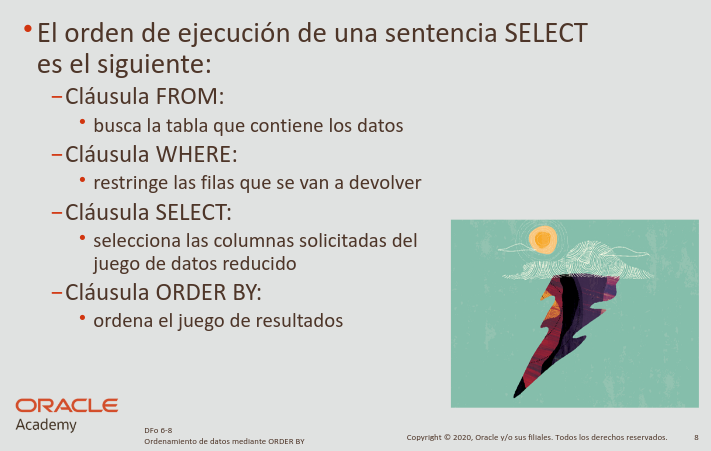

**Analisis de N principales**

El analisis de N principales es una operacion SQL utiliizada para clasificar resultados

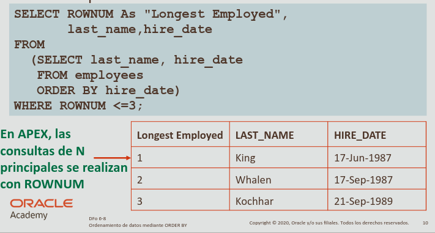

**Variables de sustitucion**

Cuando ejecutan un informe, los usuarios normalmente buscan restringir de forma dinamica los datos que se devuelven

Con ayuda de las variables de sustitucion en un archivo de comandos o en una uninca sentencia SQL. una variable se puede considerar un contenedor en el que se almacenan los valores temporalmente. Cuando se ejecuta la sentencia, el valor almacenado se sustituye

**Uso de una variable de sustitucion**

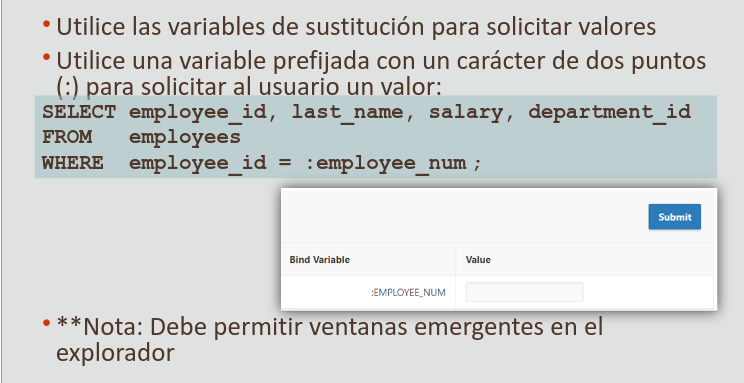

Si APEX detecta que la sentencia SQL contiene una variable de sustitucion, se le pide al usuario que introduzca un valor para esta

Despues de introducir un valor y hacer clic en Submit, los resultados aparecen en el separador Results de la sesion de APEX

**Valores de caracter y fecha con variables de sustitucion**

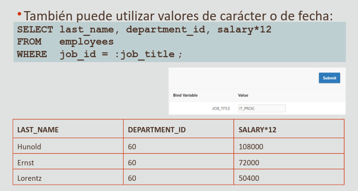

**Obtencion de datos de varias tablas**

- A veces necesita utilizar datos de mas de una tabla
- Para producir el informe, necesita enlazar las tablas EMPLOYEES y DEPARTMENTS, y acceder a los datos de ambas:

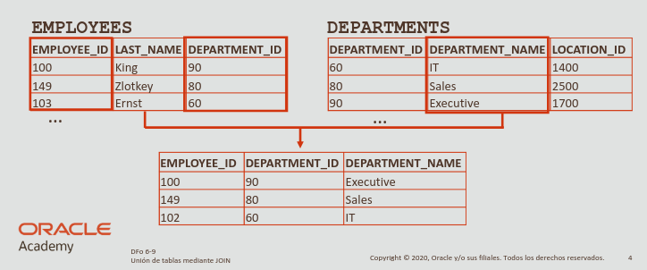

**Tipos de uniones**

- Uniones compatibles con el estandar SQL:1999:
- - Uniones naturales conclausula NATURAL JOIN
  - Uniones con clausula  USING
  - Uniones con clausula ON
  - Uniones OUTER:
  - - LEFT OUTER JOIN
    - RIGHT OUTER JOIN
    - FULL OUTER JOIN
  - CROSS JOIN

**Union de tablas mediante la sintaxis SQL:1999**

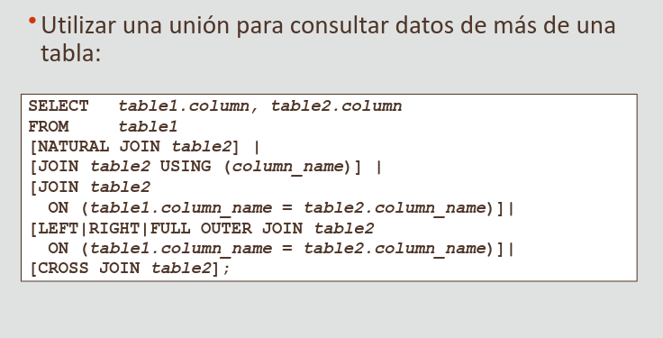

**Cualificacion de nombres de columna ambiguos**

- Utilizar prefijos de tabla para cualificar los nombres de columna que estan en varias tablas y evitar que se produzcan ambiguedades
- Utilizar prefijos de tabla para aumentar la velocidad de analisis de la sentencia
- En lugar de prefijos de nombre de tabla completo, utilizar alias de tabla
- El alias de tabla proporciona a una tabla un nombre mas corto, mantiene el codigo SQL mas pequeño y utiliza menos memoria
- Utilizar alias de tabla para distinguir columnas que tienen nombres identicos, pero que residen en diferentes tablas

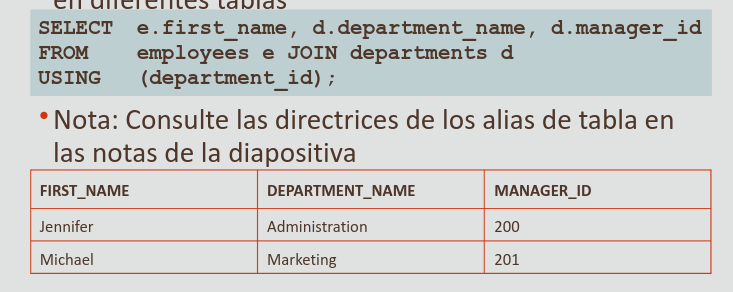

**Creacion de uniones naturales**

La clausula NATURAL JOIN esta basada en todas las columnas de las dos tablas que tienen el mismo nombre y el mismo tipo de dato

Selecciona las filas de las dos tablas que tienen valores iguales en todas las colunmas coincidentes

Si las columnas con los mismos nombres tienen tipos de datos diferentes, se devolvera un error

**Recuperacion de registros con uniones naturales**

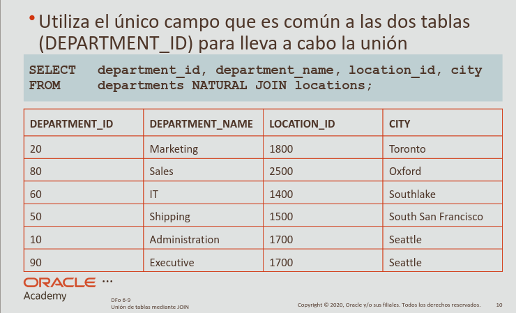

**Creacion de uniones con la clausula USING**

Si las tablas que se unen comparten varias columnas se utilizaran todos los campos comunes en la union

Utilizar USING para especificar una unica columna para una clausula JOIN en lugar de una clausula NATURAL JOIN

La clausula USING tambien se puede utilizar para hacer coincidir columnas con el mismo nombre, pero diferentes tipos de datos

Las clausulas NATURAL JOIN y USING se excluyen mutuamente

**Union de nombres de columna**

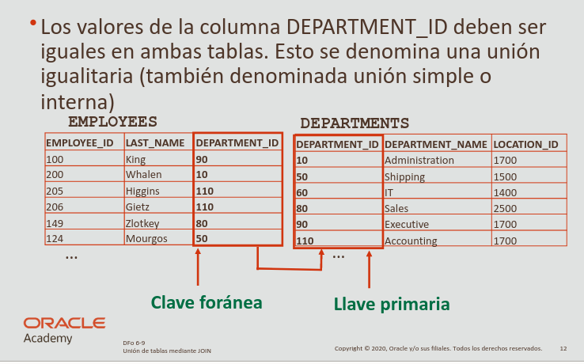

**Recuperacion de registros con la clausula USING**

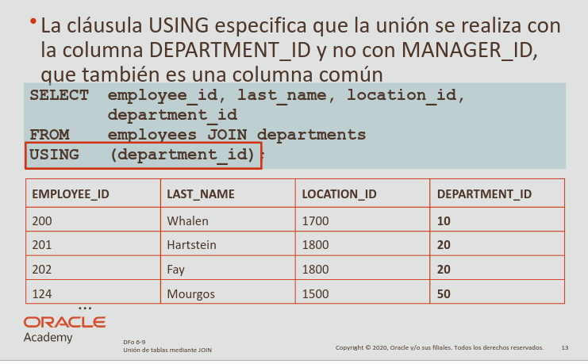

**Uso de alias de tabla con la clausula USING**

No utilizar un nombre o alias de la tabla en la clausula USING

Si la misma columna se utiliza en otro lugar de la sentencia SQL, no se le puede agregar un alias

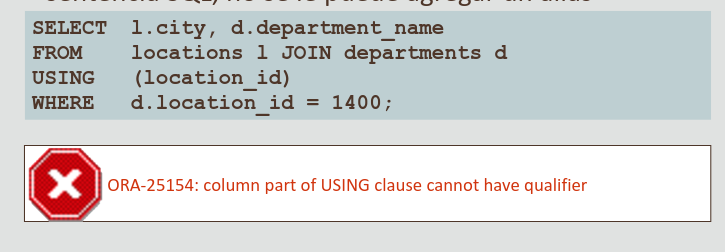

**Creacion de uniones con la clausula ON**

Con la clausula NATURAL JOIN se crea una union igualitaria de todas las columnas con el mismo nombre y tipo de datos

Utilizar la clausula ON para especificar las condiciones arbitrarias o las columnas que se van a unir

La condicion de union está separada de otras condiciones de busqueda

La clausula ON facilita la compresion del codigo

La clausula USING crear una union igualitaria entre dos tablas utilizando una columna con el mismo nombre, independientemente del tipo de dato

La clausula ON crea una union igualitaria entre dos tablas utilizando una columna de cada tabla independientemente del nombre o del tipo de dato

**Recuperacion de registros con la clausula ON**

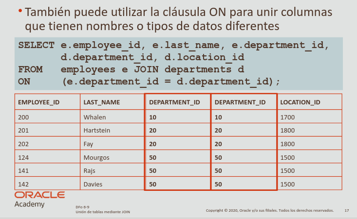

**Creacion de uniones en 3 direcciones con la clausula ON**

Debe haber 2 sentencias de union al unir 3 tablas como se muestra a continuación:

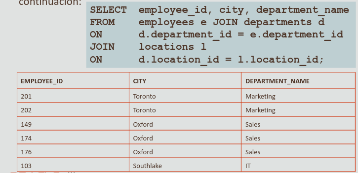

**Aplicacion de condiciones adicionales a una union**

Uso de la clausula AND o WHERE para aplicar condiciones adicionales:

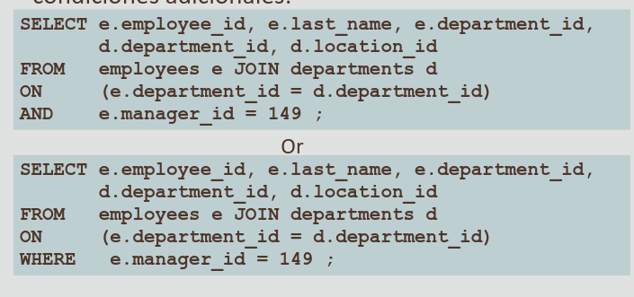

**Uniones automaticas con la clausula ON**

La clausula ON tambien se puede utilizar para unir columnas con nombres diferentes, ya sea en la misma tabla o entra diferente

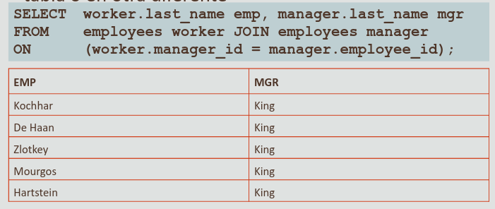

**Uniones no igualitarias**

**Recuperacion de registros con uniones no igualitarias**

Este ejemplo crea un union no igualitaria para evaluar el grado de salario de un empleado. El salario debe estar entre cualquier par de los rangos de salario bajos y altos

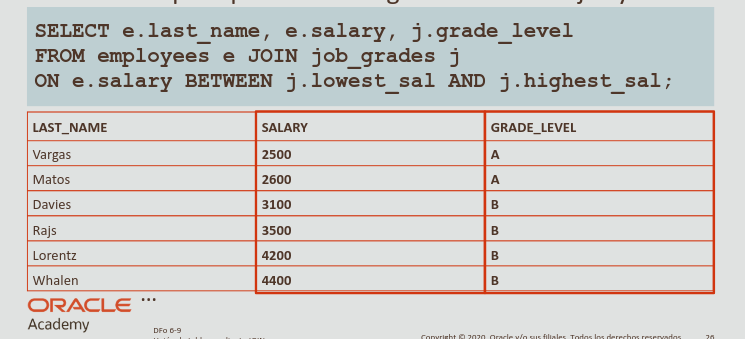

**Uniones INNE frente a uniones OUTER**

EN SQL:1999 la union de dos tablas que devuelven solo filas coincidentes se denomina union INNER. (Clausulas NATURAL JOIN, USING, ON)

Una union entre dos tablas que devuelve los resultados de la union INNER asi como las filas no coincidentes de la tabla de la izquierda (o de la derecha) se denomina una union OUTER izquierda (o derecha)

Una union entre dos tablas que devuelve los resultados de una union INNER asi como los resultados de una union OUTER izquierda y derecha es una union OUTER completa

**LEFT OUTER JOIN**

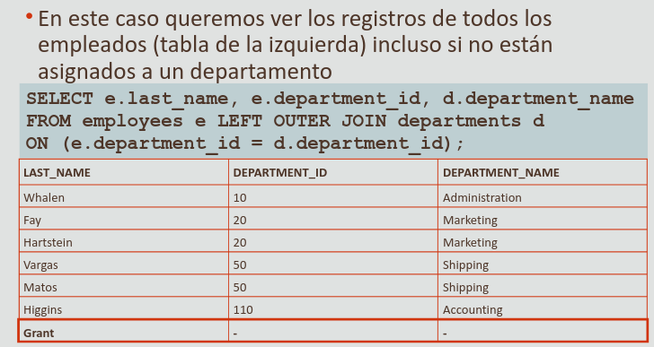

**RIGHT OUTER JOIN**

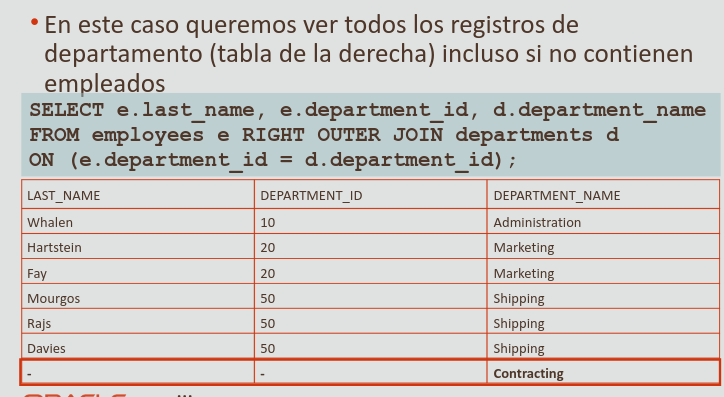

**FULL OUTER JOIN**

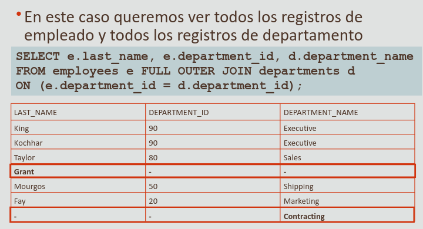

**Productos cartesianos**

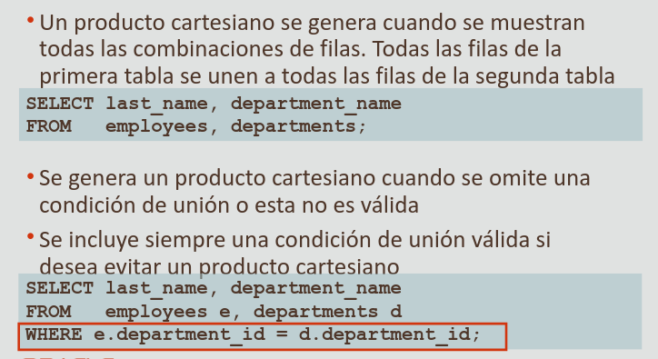

**Generacion de producto cartesiano**

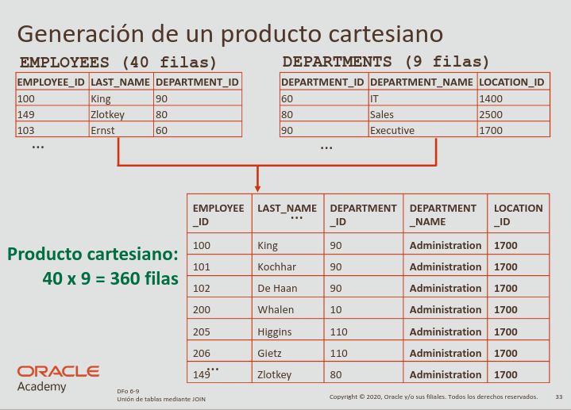

**Creacion de uniones cruzadas**

La clausula CROSS JOIN produce el producto combinado de dos tablas

Esto tambien se denomina un producto cartesiano entre dos tablas

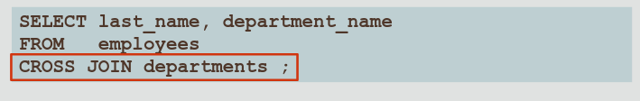

